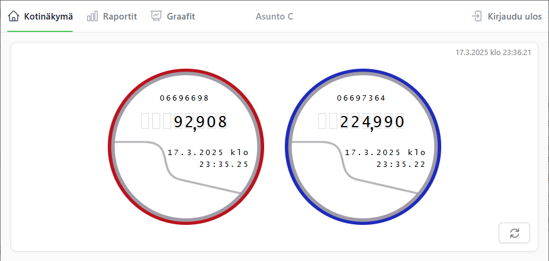
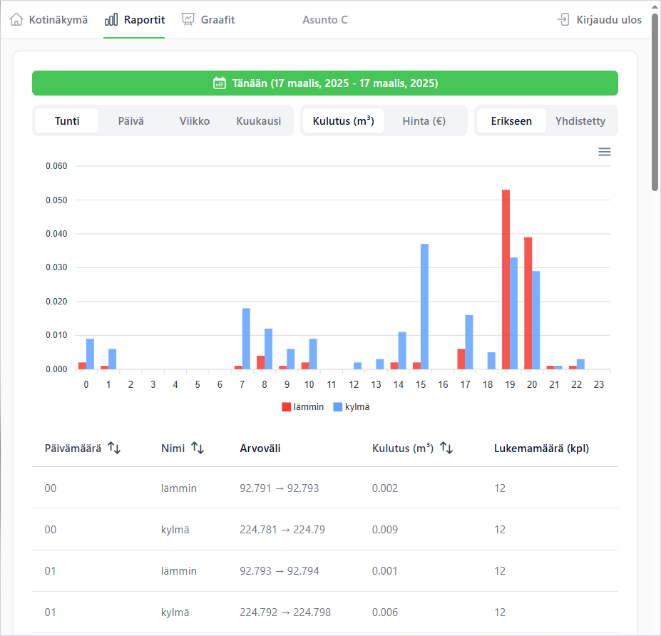
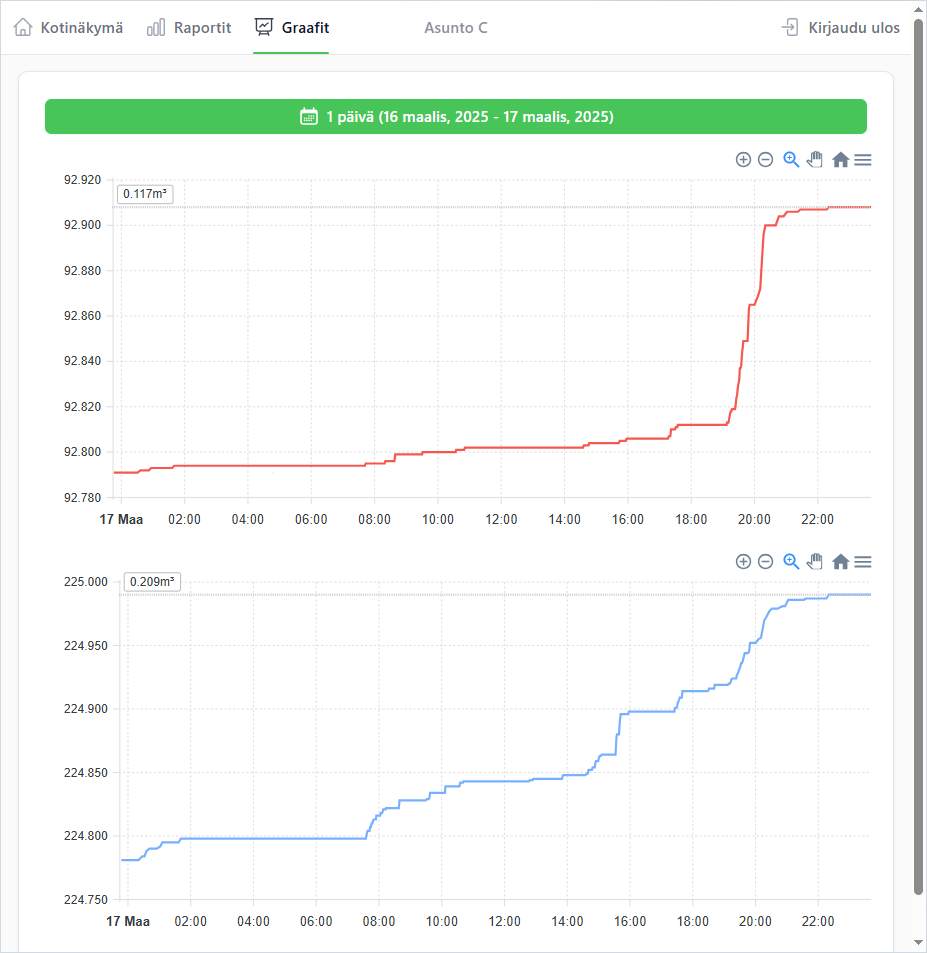

# Mittari maailma

Mittari maailma is a Nuxt 3-based web application for browsing water consumption data from Apator meters. It provides a lightweight setup for small-scale deployments, enabling efficient data retrieval and visualization for a limited number of meters.



## Features

- **User Authentication**: Login credentials are used as the encryption key (username) and database URL (password).
- **Encrypted Data Storage**: Water consumption data is securely encrypted in the Firebase database.
- **Time-Range Queries**: Measurements include a plaintext timestamp field for efficient range-based queries.
- **Lightweight Setup**: Designed for small-scale deployments, leveraging Raspberry Pi and ioBroker to collect data from Apator water consumption meters.



## Technical Details

### Data Pipeline
1. **Meters**: Apator Powogaz JS90 2,5-02 SMART+ (DN15-20) meters equipped with Apator AT-WMBUS-16-2 adaptors.
2. **Data Collection**:
    - Raspberry Pi running ioBroker with an iM871A-USB dongle that collects WMBus messages.
    - Wireless M-BUS ioBroker adapter handles message retrieval via the dongle.
    - A custom JS-script processes raw data from the adapter and sends it to a Google Firebase database.
3. **Database Structure**:
    - **Users Collection**: Contains user credentials (username matches the encryption key used during login).
    - **Latest Collection**: Contains the latest measurement for each meter ID, JSON-data stored as an encrypted string in the `encryptedData` field.
    - **Measurements Collection**: Stores encrypted meter consumption values and plaintext timestamps.

### Application
- Built with Nuxt 3 for a seamless user experience.
- Decrypts and displays consumption data using user-provided credentials.



## Setup

### Prerequisites
1. **Hardware**:
    - Apator Powogaz JS90 meters with AT-WMBUS-16-2 adaptors.
    - Raspberry Pi with ioBroker installed.
    - IMST iM871A-USB dongle.
2. **Software**:
    - Node.js (v20 recommended).
    - npm (Node Package Manager).
    - Firebase database.

### Installation
1. Clone the repository:
   ```bash
   git clone <repository-url>
   cd mittari-maailma
   ```

2. Install dependencies:
   ```bash
   npm install
   ```

3. Run the application locally:
   ```bash
   npm run dev
   ```

4. For production, generate the hostable code:
   ```bash
   npm run generate
   ```
   Copy the output files from the `.output/public` folder to your production server.

### Firebase Configuration
- Add your Firebase database URL and authentication details to ioBroker script to send data.
- Ensure the database follows the expected structure:
    - **Users** collection with usernames.
    - **Latest** collection with the latest encrypted data for each meter ID.
    - **Measurements** collection with `encryptedData` and `timestamp` fields.

## Limitations
- Not designed for large-scale deployments.
- Lightweight setup may require manual scaling adjustments for additional meters.

## Acknowledgments
- **Apator Powogaz** for their water meters.
- **IMST** for the iM871A-USB dongle.
- **Firebase** for lightweight database solutions.
- **Nuxt.js** for the modern web development framework.
- **ioBroker** for amazing automation software.
- **Wireless M-Bus Adapter** for handling message retrieval via the dongle.

